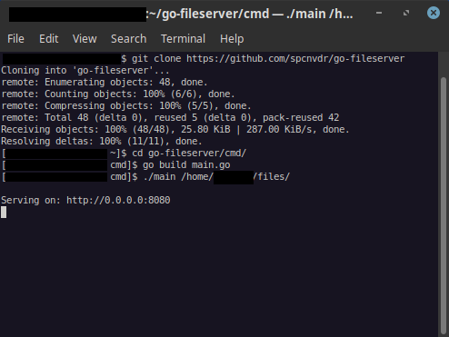
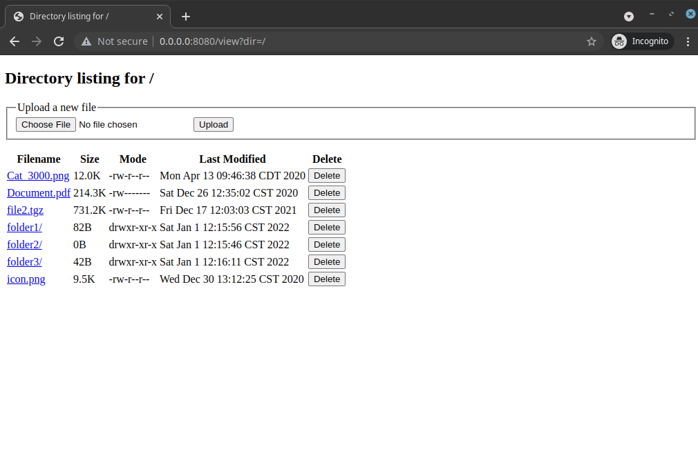

# Go File Server

This is a simple file server written in Go. Have you ever wanted to transfer 
files between computers on the same LAN? Simply run this program, give it a 
directory of files to serve, and navigate to the IP address and port number
in the other computer's web browser to download, upload, or delete files.

This program creates a web interface that allows users to download, upload, or
delete files from the serving computer. Basic authentication and TLS is 
supported and can be enabled on the command line. 

The goal of this program is to be portable and to use as few
external dependencies as possible. I wanted to use only the standard library
for this program. I also understand that this program could be cleaner if
broken up into multiple files, but I wanted it to keep it in a single source
file to make it easier to copy or send to other computers. 

Note, folders can only be deleted if empty.

**WARNING**

While this server supports TLS and basic authentication, it may not be perfect.
I would recommend only using it on a secure or trusted network. Pick a good 
password when using basic authentication. Basic authentication is useless 
without TLS enabled too! If possible, use your own TLS certs instead of 
auto-generating self-signed certificates. Auto-generated/self-signed 
certificates created using the "-t/--tls" flag are good for 2 weeks from the 
day of creation.

**NOTE**

If using a self-signed TLS certificate, you may see errors logged such as

    http: TLS handshake error from 127.0.0.1:43434: remote error: tls: unknown certificate

This error message can be safely ignored as long as you intended to use a 
self-signed certificate. This error message is just informing you that the
client received a self-signed certificate when visiting the web page.

**Defaults**

Default settings are to serve on the first available IPv4 address (0.0.0.0) on 
port 8080 using HTTP. This can be changed with command line arguments.

**Usage**

Install Go and clone this repository

    git clone https://github.com/spcnvdr/go-fileserver.git

Change into the directory inside the project

    cd ./go-fileserver/

Build the program and change into the cmd directory

    make
    cd cmd

Optionally, change into the directory and build the program manually

    cd cmd
    go build ./cmd/main.go -o mini

To compile for a different OSi or arch, simply append to the make command

    GOOS=windows make
    GOARCH=arm64 make

Run the program with --help to see available options

    ./mini --help

Serve a directory of files

    ./mini /home/user/files

Generate self-signed TLS certs and serve directory

    ./mini -t /home/user/files

Set up basic auth with existing TLS certs. Basic auth will 
interactively prompt for a password to avoid storing a password 
in .bash_history or other command line logs. 

    ./mini -c cert.pem -k key.pem -u Bob /home/user/files

This server can also accept multiple file uploads from the command line 
using cURL. Add the --insecure option if using a self-signed certificate.
The directory parameter is used to specify the sub-directory to place the 
files in. To place the files in the root of the server, use "." as the 
directory.

    curl -X POST https://IP:PORT/upload -F 'directory=home' -F 'file-upload=@./myfile.txt' -F 'file-upload=@./myfile.pdf' --insecure

    curl -X POST http://IP:PORT/upload -F 'directory=home' -F 'file-upload=@./myfile.txt' -F 'file-upload=@./myfile.pdf'

**Screenshots**

Getting started:

Open the URL given in the command line (or navigate to the given IP and port) 
in the browser:

**To Do**

- [ ] Clean up the code

**Contributing**

Pull requests, new feature suggestions, and bug reports/issues are
welcome.

**License**

This project is licensed under the 3-Clause BSD License also known as the
*"New BSD License"* or the *"Modified BSD License"*. A copy of the license
can be found in the LICENSE file. A copy can also be found at the
[Open Source Institute](https://opensource.org/licenses/BSD-3-Clause)
